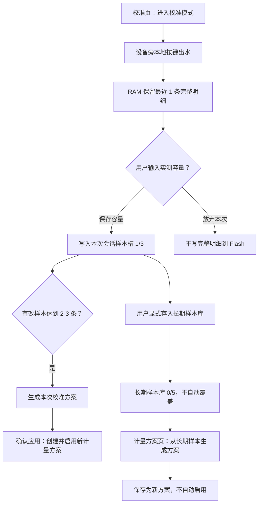

# 校准与计量方案流程重整设计

## 背景

当前校准和计量方案能力已经比较完整：校准会话、样本库、脉冲明细、分段计量生成、方案保存与切换、手工方案、测算和公式说明都已设计或实现。但这些能力在页面上仍然像“工作台”一样堆在一起，普通用户很难判断下一步该做什么。

本设计不以删除功能为首要目标，而是重新分层：

- 校准页面向普通用户，提供轻量、明确、状态驱动的校准向导。
- 计量方案页面向维护和调试，保留专业功能，但按优先级分区展示。
- 样本、脉冲、稳态识别和公式说明作为证据层保留，默认不阻塞普通校准流程。

## 目标

- 让用户在校准页始终知道“当前状态是什么、下一步该做什么”。
- 保留已经投入设计的样本、脉冲明细、方案管理和测算能力，但降低普通流程里的干扰。
- 明确普通校准会话和专业计量方案管理的不同操作语义。
- 继续保证 Web 不提供任何远程出水控制能力。
- 修正当前页面中的错误口径，统一为“推荐 3 条、最多 3 条有效样本、最多 6 次尝试”。
- 简化样本数量、计量方案记录和 Flash 数据结构，避免为了追溯存储过多低价值字段。
- 对校准、计量方案和样本库做干净重建，不为旧校准数据、旧方案结构或旧已保存明细保留兼容分支。

## 非目标

- 不改变底层计量公式。
- 不改变 Web 禁止远程出水控制的安全边界。
- 不删除长期样本库、脉冲明细、方案详情、手工方案或测算工具。
- 不在本次设计中扩展新的硬件能力。
- 不迁移旧校准样本、旧已保存明细或旧计量方案结构。
- 不为了兼容旧校准/计量方案数据保留旧字段、旧页面入口或旧生成链路。
- 不把本次校准/计量方案重构扩大到预设、滤芯、普通出水记录和基础系统配置。

## 数据兼容边界

本次重构采用“领域内干净重建、领域外保护”的边界。

可以直接重建、不兼容旧数据的领域：

- 校准会话状态文件。
- 本次校准会话样本区。
- 长期样本库。
- 计量方案文件结构。
- 旧的已保存脉冲明细参与生成流程。

这些数据如果旧版本不可读，新版本不迁移、不展示、不自动修复为旧模型。实现应使用新的文件 magic、版本和结构，避免代码中留下长期 `legacy` 分支。

必须避免无关清理的领域：

- 预设容量和预设顺序。
- 滤芯配置和滤芯累计。
- 普通出水记录。
- 系统配置、网络配置和基础运行配置。

这些数据不是本次重构对象，不能为了校准/计量方案重建而顺手清空。

## 核心原则

一句话原则：

> 校准页让普通用户完成一次量杯校准闭环；计量方案页让维护人员管理、回退和分析方案；长期样本库是默认可见的证据层；公式和参数解释是说明层，默认折叠。

具体原则：

- 主流程轻：校准页第一屏只展示当前步骤、关键指标和主动作。
- 专业能力保留：计量方案页允许复杂，但必须分区；说明文字默认折叠。
- 状态驱动：页面根据校准会话状态改变主说明和主按钮。
- 风险动作显式：任何会影响当前计量行为的动作都必须明确提示。
- 证据适度可追溯：生成方案只长期保留样本数量、容量范围、误差和来源类型；更细的生成过程放在样本详情或临时生成结果里，不进入方案长期记录。
- 数据和说明分层：样本、方案和生成结果默认可见；公式、规则解释和字段说明默认收起。

## 流程总览



## 页面职责

### 校准页

校准页是普通用户入口，只承担一次校准会话：

- 进入校准模式。
- 提示用户在设备旁通过本地按键执行出水。
- 输入本次量杯实测容量。
- 放弃本次样本并记录原因。
- 显示本次会话样本摘要。
- 达到条件后生成本次校准方案。
- 用户确认后创建并启用新计量方案。
- 提供把本次有效样本显式存入长期样本库的操作。
- 提供本次样本详情入口，用于查看脉冲图表和质量标签。

校准页不承担：

- 普通计量方案列表管理。
- 手工新建或编辑方案。
- 从长期样本库生成专业方案。
- 默认展示完整大样本表。
- 默认展开公式说明。
- 旧的 RAM 最近明细状态卡和旧已保存明细状态卡。

### 计量方案页

计量方案页是专业维护入口，承担：

- 当前启用方案摘要。
- 长期样本库，默认展示，固定 5 条。
- 长期样本库样本详情、删除和生成资格展示。
- 从长期样本库生成方案，生成结果保存为新方案但不自动启用。
- 方案列表、详情、测算、编辑、启用、停用、删除。
- 手工新建方案。
- 计量测算工具。
- 折叠的公式、参数说明和有效样本规则。

计量方案页不承担：

- 普通校准会话的进入、出水提示、实测容量录入或放弃本次样本。
- 任何远程启动、暂停、继续或停止出水能力。
- 旧已保存脉冲明细的新写入入口。

## 校准页状态设计

校准页顶部始终显示一个“当前步骤卡”。该卡由会话状态决定。

### Idle

含义：没有进行中的校准会话。

页面显示：

- 当前计量方案摘要。
- 校准准备说明。
- Web 安全边界说明：网页不会启动、暂停或停止出水。
- 主按钮：`进入校准模式`。

### Preparing

含义：已进入校准模式，等待用户准备量杯、水路和设备。

页面显示：

- “请准备量杯或容器，并确认水路已打开。”
- “到设备旁按 OK 继续。”
- 主按钮：`退出校准模式`。

### WaitingLocalRun

含义：等待用户在设备旁启动本次校准出水。

页面显示：

- “设备旁按 OK 开始本次校准出水。”
- “网页不会启动出水。”
- 当前有效样本数、尝试次数和容量范围。
- 主按钮：`退出校准模式`。

### Running

含义：本地正在进行校准出水。

页面显示：

- “正在校准出水。”
- “如需停止，请在设备旁按 CANCEL。”
- 不显示任何 Web 停止、暂停或继续按钮。

### AwaitingActual

含义：本次出水已结束，等待输入量杯读数或放弃本次样本。

页面显示：

- 本次记录摘要：目标、估算出水、有效脉冲、持续时间、结束原因。
- 实测容量输入框，单位 ml。
- 主按钮：`保存为有效样本`。
- 次按钮：`放弃本次样本`。
- 放弃原因选择：
  - 量杯溢出或读数不准。
  - 未接好水。
  - 水路未打开或出水异常。
  - 误操作。
  - 其他。

### ReadyToGenerate

含义：已有足够有效样本，可生成本次校准方案。

页面显示：

- 有效样本数。
- 尝试次数。
- 最小和最大实测容量。
- 容量跨度质量：
  - 小于 500 ml：不可生成。
  - 500-999 ml：可快速生成，但提示覆盖偏窄。
  - 1000 ml 以上：推荐生成。
- 主按钮：`生成本次校准方案`。
- 次按钮：`继续补测样本`，仅在有效样本少于 3 条时显示，通过设备旁按 OK 继续。

### Generated

含义：本次会话已生成待应用结果。

页面显示：

- 5 个计量参数，分为容量估算参数和时间估算参数。
- 样本数量。
- 容量范围。
- 最大绝对误差和最大相对误差。
- 启动阶段时长可作为本次生成结果的临时辅助信息显示，但不写入长期计量方案记录。
- 明确提示：确认应用后会创建并启用新计量方案，旧方案保留。
- 主按钮：`确认应用`。
- 次按钮：`放弃生成结果` 或 `继续补测后重新生成`。

生成结果只是临时候选，不作为独立长期 Flash 数据。页面刷新或设备重启后，可以基于已保存的有效样本重新生成；用户确认应用后才写入正式计量方案。

### Applied

含义：本次校准方案已创建并启用。

页面显示：

- 新方案名称和 ID。
- “已启用为当前计量方案。”
- 旧方案仍在计量方案页保留，可回退。
- 主入口：`查看计量方案`。

### Discarded / Failed

含义：会话已放弃或无法继续。

页面显示：

- 清晰原因。
- 可重新开始校准。
- 对普通出水记录、统计和滤芯累计的影响说明：已发生的出水仍按普通出水记录处理，不因放弃样本而删除。

## 样本规则

- 最少有效样本：2 条，可快速生成。
- 推荐有效样本：3 条，即小容量、常用容量、较大容量各 1 条。
- 最多有效样本：3 条。普通校准会话不再追求 4-5 条有效样本，避免流程过长和存储过重。
- 最多尝试次数：6 次，包含有效、放弃和系统判定无效。6 次已经足够覆盖 3 条有效样本和少量失误；超过 6 次说明水路、量杯或操作需要重新检查。
- 有效样本需要满足：
  - 有完整脉冲明细。
  - 已录入实测容量。
  - 原始边沿未超过单条上限导致截断。
  - 未发生暂停后恢复。
  - 有有效脉冲。
  - 稳态识别和拟合通过质量门槛。

样本展示分层：

- 校准页默认只展示本次会话样本摘要。
- 样本详情作为高级入口展示脉冲明细、无效原因和质量标签。
- 长期样本库在计量方案页默认展示，不折叠；它是长期计量方案生成的证据来源。
- 长期样本库列表只展示必要字段：时间、实测容量、脉冲、稳态状态、是否可用于生成和操作。
- 长期样本库辅助信息使用小字展示，例如“已保存 3/5 条、单条最多 4096 点、文件约 xx KB”。

本样本数量规则取代旧设计中的“最多 5 条有效样本、最多 10 次尝试”。长期样本库用于专业复盘，不用于拉长普通校准会话。

## 页面结构

### 校准页结构

校准页按状态驱动，只服务本次会话：

1. 当前校准状态和下一步。
2. 本次会话样本，最多 3 条，默认展示。
3. 本次校准方案生成结果。
4. 确认应用动作。
5. 简短安全提示：网页不控制出水，出水只能通过本地按键。

校准页不再展示：

- RAM 最近明细卡片。
- 旧已保存明细卡片。
- 长期样本库完整列表。
- 长篇公式说明。
- 专业计量方案列表和手工方案管理。

### 计量方案页结构

计量方案页按专业维护顺序展示：

1. 当前启用方案摘要。
2. 长期样本库，固定 5 条，默认展示。
3. 从长期样本库生成方案和生成结果。
4. 方案列表、详情和管理操作。
5. 测算工具。
6. 折叠说明区。

计量方案页中默认展示的是数据和操作；折叠的是说明文字，包括公式、字段解释、有效样本条件、误差说明和生成规则。

## 计量方案规则

### 普通校准会话

普通校准会话的完成动作是 `确认应用`：

```text
确认应用 -> 创建新计量方案 -> 启用新方案 -> 旧方案保留
```

这是普通用户流程的闭环。用户已经在校准上下文中确认结果，因此不再要求额外去计量方案页手动启用。

### 专业计量方案页

计量方案页从长期样本库生成方案时保持专业流程：

```text
生成结果 -> 保存为新方案 -> 用户显式启用
```

保存生成结果不自动影响当前计量。只有点击 `启用` 后，设备才切换当前计量方案。

### 方案列表操作

方案列表默认展示：

- 当前方案。
- 可用方案。
- 停用方案摘要或折叠入口。

每套方案展示：

- 名称、ID、revision。
- 来源：默认、校准会话生成、长期样本生成、手工。
- 容量估算计量参数：启动脉冲数、启动水量、稳态 P/L。
- 时间估算计量参数：启动时长、预计稳态流速。
- 使用状态：从未使用、已使用或使用统计可能不完整。
- 最小生成摘要：样本数量、实测容量范围、最大误差。

操作规则：

- 当前方案不能删除或停用。
- 已被出水记录使用过的方案不能物理删除，只能停用。
- 未使用、非当前且删除后仍有可用方案时，可以删除。
- 停用方案可恢复为可用后再启用。
- 编辑当前方案必须提示“保存后会立即影响后续出水估算”。

## 功能取舍

### 保留在校准主流程

- 进入/退出校准模式。
- 本地按键下一步提示。
- 实测容量录入。
- 放弃本次样本和原因。
- 生成本次校准方案。
- 确认应用。
- 本次会话样本摘要。

### 放到计量方案页默认展示

- 长期样本库列表。
- 从长期样本库生成方案。

### 降级为详情入口或折叠说明

- 脉冲明细图表。
- 样本稳态识别细节。
- 公式说明。
- 手工方案新建和编辑。
- 测算工具。

### 删除或合并

- 校准页默认大样本表。
- 校准页中的普通方案管理。
- 校准页顶部 RAM 最近明细卡。
- 校准页和计量方案页顶部旧已保存明细卡。
- 新流程中的旧已保存脉冲明细保存入口。
- 新计量方案生成对旧 `savedPulseTraces` 的依赖。
- “最多 5 次尝试”等错误表达。
- 没有上下文的单独 P/L 展示。
- 固定放弃原因为误操作。
- 重复的生成入口和含糊文案。

## 简化后的计量方案数据结构

计量方案长期记录只保存运行和管理必需字段。旧设计中过细的生成依据不进入长期方案记录。

### 必须长期保存

- `id`：稳定方案 ID。
- `recordUsed`：底层槽位是否占用，仅作为存储层删除标记，不作为页面概念。
- `state`：用户可见状态，`available` 或 `disabled`。
- `name`：方案名称。
- `params`：5 个计量参数。
  - 启动脉冲数。
  - 启动水量。
  - 稳态 P/L。
  - 启动时长。
  - 预计稳态流速。
- `sourceType`：默认、校准会话生成、长期样本生成、手工。
- `revision`：5 个计量参数变化时递增。
- `createdAt`：创建时间。
- `updatedAt`：最近修改时间。
- `usedEver`：是否已经被至少一条出水记录使用过，用于决定是否允许物理删除。

### 生成方案的最小摘要

仅当方案来自样本生成时保存：

- `sampleCount`：参与生成的有效样本数量，普通校准为 2-3，长期样本生成为 2-5。
- `minActualMl`：生成样本最小实测容量。
- `maxActualMl`：生成样本最大实测容量。
- `maxErrorMl`：生成拟合最大绝对误差。
- `maxErrorTenthPercent`：生成拟合最大相对误差，使用整数十分之一百分比，避免长期结构里保存 `float`。

这些字段只用于页面快速判断方案可信度，不用于重新生成，也不作为完整审计记录。

### 不再长期保存

- 参与样本 traceId 数组。
- 启动阶段最小、最大、中位、平均时长统计。
- 长篇创建说明。
- 长篇最近修改说明。
- 流量计标识、水路、环境标签、用户备注等多组文本字段。
- 精确累计使用次数和最近使用时间。
- 使用状态 dirty 标记。

删除这些字段的理由：

- 它们不参与运行计量。
- 对普通用户决策价值低。
- 会增大每条方案记录和结构复杂度。
- 会诱导页面继续展示过多专业信息。

如果后续确实需要完整审计，应通过导出样本、导出日志或外部分析完成，而不是把 ESP32 端方案记录做成审计数据库。

### 生成结果候选

生成结果候选使用同样的最小结构，但只作为 RAM/即时计算结果：

- `ready`。
- `sourceType`。
- 5 个计量参数。
- 生成时间。
- 样本数量、容量范围、最大误差。

候选结果不写入独立长期 Flash，不保存完整样本列表，不保存长说明。页面需要展示更细生成过程时，应基于当前样本即时计算；用户保存或确认应用后，才创建正式计量方案记录。

## Web 安全边界

Web 可以执行：

- 进入或退出校准模式。
- 查看校准状态。
- 保存实测容量。
- 放弃本次样本。
- 生成本次校准方案。
- 确认应用本次校准方案。
- 管理计量方案。
- 查看样本详情、长期样本库和脉冲明细。

Web 不可以执行：

- 启动出水。
- 暂停出水。
- 继续出水。
- 停止出水。

页面和 API 都不得新增 `/api/faucet/water/*`、`/api/faucet/start`、`/api/faucet/stop` 或同义远程出水控制接口。

## 持久化与保护

- 校准、计量方案和样本库采用新文件结构，不迁移旧结构，不保留旧字段兼容。
- 旧校准会话、旧长期样本、旧已保存明细和旧计量方案文件在新流程中不读取、不展示、不参与生成。
- 预设、滤芯、普通出水记录和基础系统配置不是本次重构对象，不应被本次重构清理。
- 校准会话样本区仍是当前或最近一次会话的工作区，新会话可覆盖。
- 长期样本库不自动覆盖，满时提示清理。
- 每条出水记录必须能追溯当时的计量方案快照，优先把快照内联到记录格式，历史记录不依赖方案当前状态。
- 正式计量方案必须保存最小生成摘要，避免会话样本被覆盖后失去基本追溯。

## Flash 存储复审与收紧规则

本功能必须按“高频路径最小写入、低频证据显式保存”的原则实现。完整脉冲明细是最重的数据：单条最多 `4096` 个 `elapsedUs`，约 16 KiB。任何自动保存完整明细的规则都必须非常克制。

### Flash 写入分级

必须写入的高频事实：

- 出水记录。每次出水结束追加一条记录，这是历史、统计重建和排查的事实源。

可以降频或合并的派生数据：

- 统计累计。
- 滤芯累计。
- 计量方案使用状态。
- 计量方案快照索引。

低频显式证据：

- 校准会话有效样本完整明细。
- 长期样本库完整明细。
- 正式计量方案记录。

### 普通出水高频路径

普通出水完成后，Flash 写入应尽量收敛为一条出水记录。其他派生数据按以下规则处理：

- 统计和滤芯累计应视为缓存或检查点，不应成为每次出水必须同步写入的强一致数据。
- 后续实现应优先支持按记录数、累计水量、时间间隔或空闲窗口批量落盘。例如累计若干次出水后保存一次，或进入空闲后延迟保存。
- 如果设备异常断电导致统计或滤芯检查点落后，系统应能通过出水记录和检查点恢复到可接受状态；不能因此丢失出水记录。
- 计量方案不应追求精确 `useCount`。长期结构只要求 `usedEver`，用于保护已使用方案不被物理删除；展示用使用次数不提供。
- 首次成功出水后，如果当前方案 `usedEver` 仍为 false，系统尽力把它更新为 true；后续成功出水不再写方案记录。如果这次更新失败，不新增 dirty 字段，历史追溯仍以出水记录内联快照为准。

### 计量快照存储

历史记录必须能追溯当时使用的计量参数，但不应为此长期维护一条记录对应一个独立大文件写入。

推荐实现方向：

- 新记录格式优先把计量方案 ID、revision 和 5 个计量参数内联到出水记录中，减少每次出水的文件写入次数。
- 如果短期内保留独立计量快照文件，也必须把它视为过渡实现；实现计划中应评估合并到记录格式的迁移路径。
- 页面展示历史记录时以记录内快照为准；方案当前状态不能反推历史。

### 校准会话样本写入

校准会话不应在出水结束后立刻把完整 pending 明细写入 Flash。推荐规则：

- 出水过程中和出水结束后，完整明细先保留在 RAM 最近明细中。
- `AwaitingActual` 状态只在会话小状态文件中保存“有一条待录入样本”的摘要和记录身份，不写完整明细数组。
- 用户保存实测容量后，系统校验 RAM 明细仍存在且样本有效，再把完整明细写入会话样本槽，并提交为有效样本。
- 用户放弃本次、样本无效或 RAM 明细已经丢失时，不写完整明细。
- 如果设备在 `AwaitingActual` 期间断电，重启后该待录入样本标记为无效或丢失，提示用户重测；不为了恢复待录入样本而提前写 16 KiB 级别的 pending 明细。

这个取舍牺牲了“断电后继续录入上一条样本”的能力，但显著减少放弃样本、误操作样本和读数失败样本对 Flash 的写入。

### 长期样本库

长期样本库是专业证据库，不是普通校准主流程必需数据。

- 长期样本必须由用户显式保存，不自动写入。
- 长期样本库不应在设备启动时强制预分配大文件；应在首次保存长期样本时懒创建。
- 首版长期样本上限固定为 5 条完整明细。更多历史样本应通过导出、外部分析或后续压缩格式解决，而不是继续扩大设备端 Flash 常驻空间。
- 长期样本满时只提示用户删除旧样本，不自动覆盖。

### 会话样本区

- 会话样本区最多保存 3 条有效样本完整明细。
- 会话样本区应在开始校准会话时准备，或在第一条有效样本保存时懒创建；不应成为普通开机路径的硬依赖。
- 新会话可以覆盖旧会话样本区。已经应用的计量方案必须保存生成依据摘要，因此不依赖旧会话完整明细长期存在。

### 旧脉冲明细存储收敛

当前历史上存在 RAM 最近明细、旧已保存脉冲明细、校准会话样本区和长期样本库等多套概念。后续实现必须避免继续扩大重复存储。

- 新校准和新计量方案生成只应使用校准会话样本区和长期样本库。
- 旧的已保存脉冲明细文件不再作为历史诊断或迁移兼容入口出现在新页面中。
- 旧保存入口应从新页面删除；新功能不再写入旧已保存明细文件。
- 页面不得同时引导用户把同一条样本保存到多个完整明细库。
- 实现计划应明确删除或隐藏旧保存入口，避免用户无意中写入重复 Flash 数据。

### 启动与空间策略

- 启动时不要因为长期样本库文件不存在就立即创建大文件。
- 校准相关大文件应懒创建，并在创建前检查可用空间。
- 空间不足时，普通出水和出水记录优先；校准样本和长期样本保存失败应清晰提示，不得影响关阀、安全控制或普通记录写入。
- 任何页面刷新、列表查看、生成预览或测算操作都不得写 Flash。

## 页面文案准则

- 使用“校准会话”“本次样本”“有效样本”“尝试次数”“当前计量方案”“确认应用”等明确词。
- 不使用旧概念，如“控制 P/L”“启动补偿”“启动等效”。
- 不单独展示无上下文的“全程平均 P/L”。
- 明确区分：
  - 实时流速：运行中窗口估算。
  - 预计稳态流速：方案时间估算参数。
  - 平均流速：出水完成后的记录统计。
- 时间估算参数必须说明只用于预计展示，不参与实际容量、滤芯累计或统计累计。

## 实现关注点

- 校准页渲染应围绕 `CalibrationSessionStatus` 做状态分支。
- `AppSnapshot` 需要提供页面所需的状态摘要，包括当前尝试、最后一次待录入记录、样本跨度和失败原因。
- `skip_attempt` 需要接收放弃原因，不应固定为 `Mistake`。
- 页面应修正尝试次数和有效样本上限的文案。
- 页面应显示普通校准“推荐 3 条、最多 3 条有效样本、最多 6 次尝试”。
- 计量方案页应把当前方案摘要放在第一屏。
- 计量方案页中的长期样本库和长期样本生成默认展示；手工新建、测算和公式说明可折叠或入口化。
- Flash 写入路径需要在实现计划中单独拆任务：先收敛普通出水高频写入，再做校准样本写入，最后处理长期样本库和旧脉冲明细入口。
- 校准会话 `AwaitingActual` 不应提前写完整明细；保存实测容量时才写有效样本完整明细。
- 长期样本库和校准大文件应懒创建，不作为启动路径硬依赖。
- 计量快照应优先合并进新记录格式；短期保留独立快照文件时必须标为过渡方案。
- 计量方案结构应按“运行必需 + 最小生成摘要”重建，不迁就旧的大字段结构；生成结果候选不作为独立长期 Flash 数据。
- 路由和测试继续验证 Web 不存在远程出水控制入口。

## 测试关注点

- 校准页在各状态下显示正确主说明和主按钮。
- 校准页显示“推荐 3 条、最多 3 条有效样本、最多 6 次尝试”。
- `AwaitingActual` 状态可提交实测容量和放弃原因。
- `Running` 状态不出现任何 Web 停止、暂停或继续按钮。
- 普通校准会话 `确认应用` 创建并启用新方案。
- 计量方案页长期样本生成保存为新方案后不自动启用。
- 计量方案页第一屏包含当前方案摘要。
- 当前方案不能删除或停用。
- 已使用方案只能停用，未使用方案在满足条件时可删除。
- 计量方案记录不包含样本 traceId 数组、启动阶段统计、长摘要、精确使用次数和使用状态 dirty 标记。
- 计量方案生成结果只作为临时候选，保存或确认应用后才形成正式方案记录。
- 长期样本库最多 5 条完整明细。
- 普通出水完成的高频写入路径不应保存完整脉冲明细。
- 放弃样本、无效样本和丢失 RAM 明细的样本不应写入会话完整明细槽。
- 页面刷新、样本列表查看、生成预览和测算不应写 Flash。
- `pio test -e native` 通过。
- `pio run -e esp32dev` 通过。
