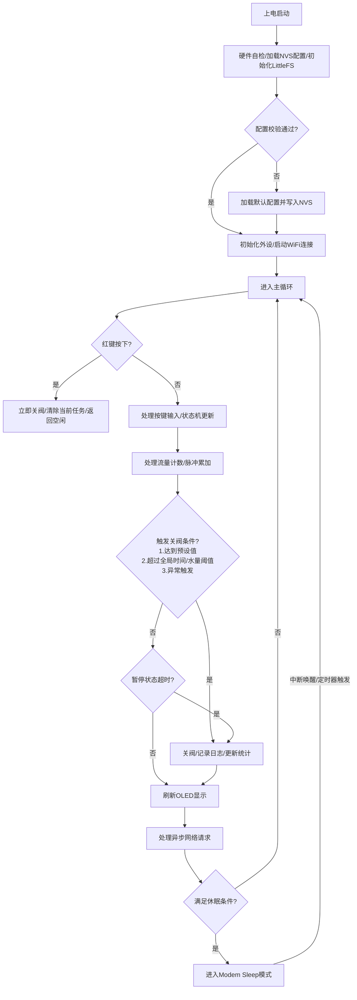
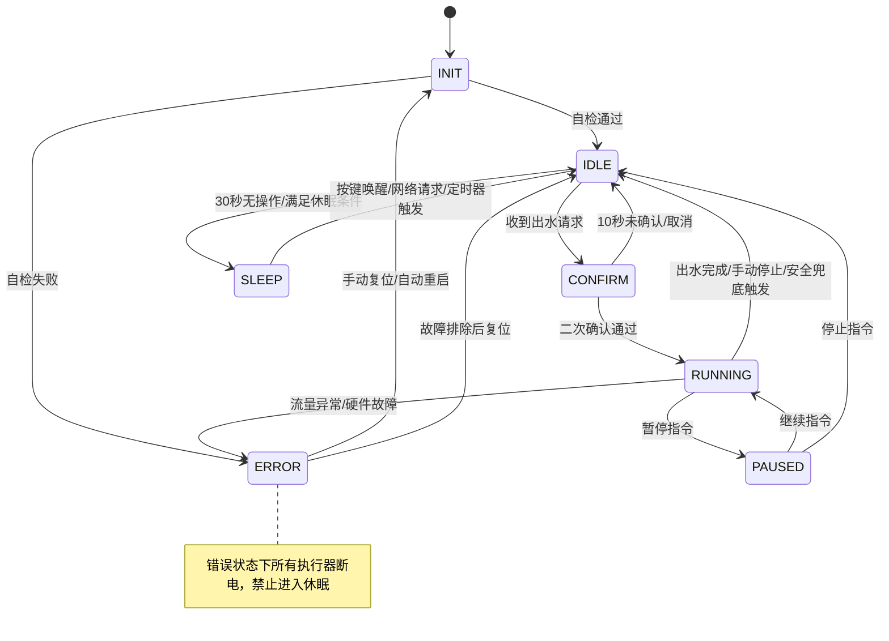
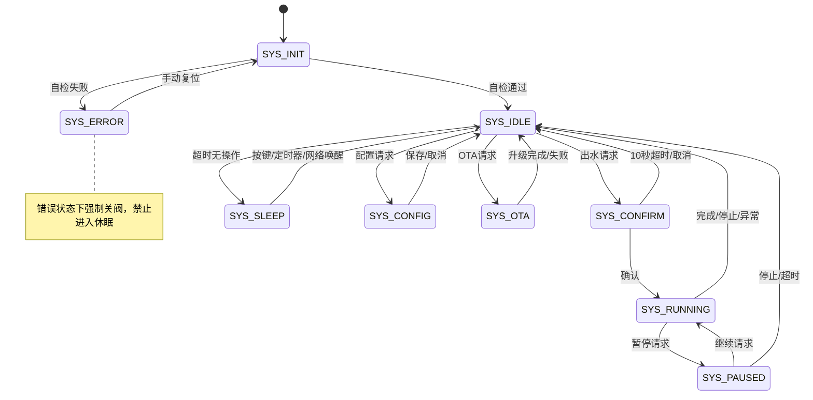
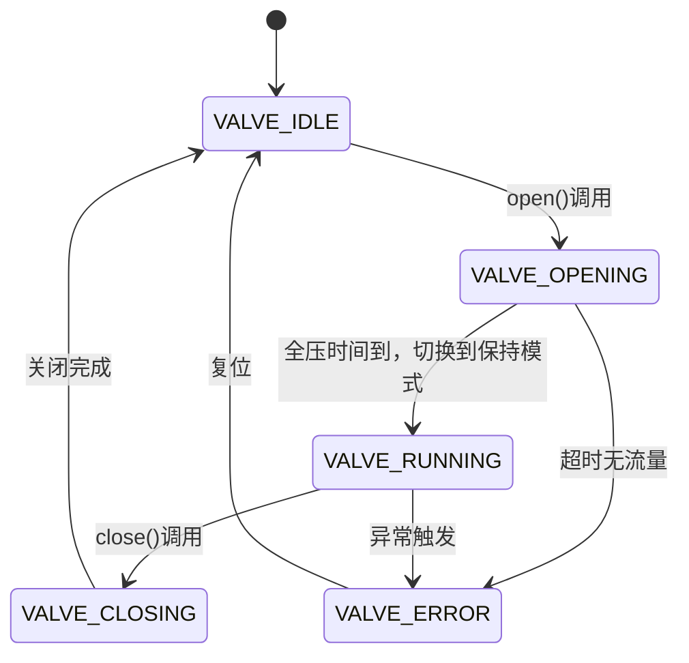
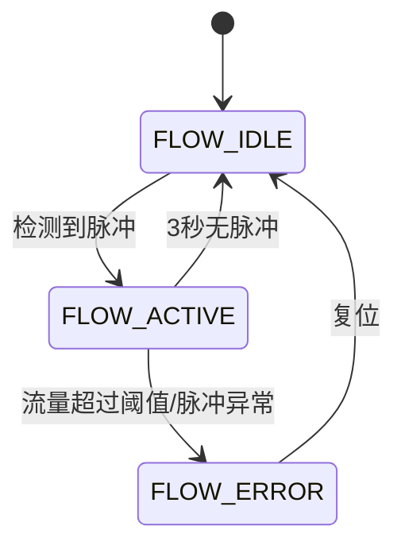

---
> 历史背景文档，仅作需求来源参考；最新项目规则和设计以 `AGENTS.md` 与 `docs/` 为准。

# DOC-03 软件架构设计
| 字段 | 内容 |
|------|------|
| 文档编号 | DOC-03 |
| 项目名称 | ESP32 智能定量出水龙头 |
| 版本 | v1.0 |
| 日期 | 2026-04-16 |
| 状态 | 已确认 |
---

## 1. 架构概览（结构固定）
```
┌─────────────────────────────────────────┐
│           应用层（Application）           │
│  main.cpp：系统初始化、FreeRTOS任务创建、全局调度  │
├─────────────────────────────────────────┤
│         业务逻辑层（Business Logic）      │
│  Controller/Manager：核心状态机、业务逻辑、参数管理、网络服务  │
├─────────────────────────────────────────┤
│       硬件抽象层（HAL / Drivers）         │
│  各驱动类：封装硬件操作，屏蔽寄存器细节，提供统一接口  │
└─────────────────────────────────────────┘
```
**层间规则**：上层单向调用下层，下层不得`#include`上层头文件，违反此规则的代码不予接受。所有硬件操作全部封闭在HAL层，业务逻辑层不直接操作寄存器或外设。

---
## 2. 核心业务逻辑
> 本节定义设备的完整行为规则，是后续状态机、接口、代码设计的唯一依据
---

### 2.1 概念与术语定义（强制）
#### 术语表
| 术语 | 精确定义 |
|------|----------|
| 出水任务 | 一次完整的出水流程，包含二次确认、启动出水、流量计数、自动停止、日志记录全流程 |
| 脉冲系数 | 每流过1ml水，YF-S201流量计输出的脉冲数，校准后取值范围300-600，默认450 |
| 出水预设 | 预存的常用出水参数，共9组，每组支持独立配置类型（容量/时间）、数值、名称、启用/禁用状态 |
| 滤芯寿命 | 按累计流量和使用时间双重计算的滤芯剩余寿命，支持9个独立滤芯，每个可自定义阈值 |
| 硬关阀 | 通过外部串联的12V船型开关物理切断电磁阀电源，优先级最高，不受软件控制 |
| 软关阀 | 软件控制MOS管切断电磁阀电源，包含红键紧急停止、自动关阀、异常关阀三种触发方式 |
| 安全兜底机制 | 强制启用的双重关阀逻辑：全局最大出水时间（默认30分钟，可配置）、全局最大出水量（默认30L，可配置），任何出水任务超过这两个阈值之一立即强制关阀，不可关闭，用于故障保护 |

#### 核心数据模型
```cpp
/**
 * @brief 出水日志结构体，每条10字节，20000条共占200KB
*/
typedef struct {
    uint32_t start_time;    // 出水开始时间戳（UTC秒）
    uint16_t volume_ml;     // 总出水量（单位ml，范围0-65535，无业务上限，支持最大65L出水）
    uint16_t duration_sec;  // 出水时长（单位秒，范围0-65535，无业务上限，支持最长18小时出水）
    uint8_t type;           // 出水类型：0=定量/1=定时/2=手动/3=异常停止/4=暂停超时停止
    uint8_t crc8;           // 数据校验位
} WaterLog_t;

/**
 * @brief 出水预设配置结构体，支持容量和时间两种类型
*/
typedef struct {
    uint8_t type;           // 预设类型：0=容量预设（单位ml）/1=时间预设（单位秒）
    uint16_t value;         // 预设数值，容量ml/时间秒，范围0-65535
    bool enabled;           // 是否启用
    char name[16];          // 自定义名称（如"7.5L水桶"/"10分钟出水"）
} Preset_t;

/**
 * @brief 滤芯配置结构体，支持9个独立滤芯
*/
typedef struct {
    char name[16];          // 滤芯名称
    uint32_t total_flow_ml; // 流量阈值，单位ml，无上限
    uint32_t total_days;    // 时间阈值，单位天，无上限
    uint32_t used_flow_ml;  // 已使用流量
    uint32_t start_time;    // 更换时间戳
    bool enabled;           // 是否启用
} Filter_t;

/**
 * @brief 全局配置结构体，存储在NVS中
 * @note  总大小约1200字节，NVS blob存储上限4000字节，余量充足
*/
typedef struct {
    uint8_t  version;                     // 配置版本号，当前=1

    // ── 流量计三段非线性校准 ──────────────────────────────
    uint16_t pulse_coeff_low;             // 低流量脉冲系数（<th1），默认460
    uint16_t pulse_coeff_mid;             // 中流量脉冲系数（th1~th2），默认450
    uint16_t pulse_coeff_high;            // 高流量脉冲系数（>th2），默认440
    uint16_t flow_threshold_1;            // 低/中分界点 ml/min，默认1000
    uint16_t flow_threshold_2;            // 中/高分界点 ml/min，默认5000
    uint16_t flow_anomaly_lpm10;          // 流量异常阈值×10（精度0.1L/min），默认300（=30L/min）
    uint16_t bubble_filter_us;            // 气泡过滤脉冲间隔 µs，默认500（0.5ms）

    // ── 安全兜底参数（双重保护，不可关闭）───────────────
    uint32_t max_out_time_sec;            // 全局最大出水时间 秒，默认1800（30min）
    uint32_t max_out_volume_ml;           // 全局最大出水量 ml，默认30000（30L）
    uint8_t  overflow_percent;            // 超量关阀阈值（相对预设值的%），默认10
    uint16_t no_flow_timeout_sec;         // 开阀后无流量超时判定 秒，默认3
    uint8_t  flow_anomaly_protect;        // 流量异常保护：1=开启，默认1（不可关闭，仅内部标志）

    // ── 出水控制参数 ────────────────────────────────────
    uint8_t  second_confirm_enable;       // 出水二次确认：1=开启，默认1
    uint16_t pause_timeout_sec;           // 暂停超时自动关阀 秒，默认300，范围0-3600
    uint8_t  power_resume_enable;         // 断电恢复出水：1=开启，默认0（安全优先）

    // ── 漏水检测参数 ────────────────────────────────────
    uint8_t  leak_sensitivity;            // 灵敏度：0=低/1=中/2=高，默认2
    uint8_t  leak_protect_enable;         // 漏水自动关阀：1=开启，默认1

    // ── 电磁阀驱动参数 ──────────────────────────────────
    uint8_t  valve_hold_duty;             // 保持阶段PWM占空比 %，默认30
    uint8_t  valve_full_power_sec;        // 全压吸合时间 秒，默认3，范围1-10

    // ── 显示参数 ────────────────────────────────────────
    uint8_t  oled_brightness;             // OLED亮度 0-100，默认50
    uint8_t  oled_display_mode;           // 显示模式：0=自动轮播/1=固定核心页，默认0
    uint8_t  oled_priority;               // 出水优先级：0=剩余容量/1=剩余时间，默认0
    uint8_t  oled_scroll_interval_sec;    // 轮播切换间隔 秒，默认3，范围2-10
    uint32_t sleep_delay_sec;             // 无操作休眠时间 秒，默认30，范围10-300

    // ── 输入参数 ────────────────────────────────────────
    uint16_t encoder_sensitivity_ml;      // EC11旋转步长 ml，默认100，范围50-500

    // ── 蜂鸣器参数 ──────────────────────────────────────
    uint8_t  beep_enable;                 // 蜂鸣器：1=开启，默认1
    uint8_t  beep_volume;                 // 蜂鸣器音量 0-100，默认70

    // ── 滤芯提醒参数 ────────────────────────────────────
    uint8_t  filter_remind_percent;       // 提前提醒阈值 %，默认10，范围0-30

    // ── 时间与网络参数 ──────────────────────────────────
    char     ntp_server[64];              // NTP服务器地址，默认"cn.pool.ntp.org"
    int8_t   timezone_offset;             // 时区 UTC±，默认8（UTC+8）
    uint8_t  ntp_sync_interval_h;         // NTP对时间隔 小时，默认24，范围1-72
    uint8_t  rtc_mode;                    // DS3231：0=禁用/1=启用/2=自动检测，默认2
    char     wifi_ssid[32];               // WiFi SSID
    char     wifi_password[64];           // WiFi密码
    char     hostname[32];                // 设备hostname，默认water-xxxx
    uint8_t  wifi_reconnect_max_min;      // WiFi重连最大间隔 分钟，默认30，范围1-60
    char     web_password[32];            // Web管理密码，默认"admin"
    char     ota_password[32];            // OTA升级密码，默认"admin"
    uint16_t web_port;                    // Web服务端口，默认80

    // ── 预设与滤芯（固定数组）──────────────────────────
    Preset_t presets[9];                  // 9组出水预设
    Filter_t filters[9];                  // 9个滤芯配置

    uint8_t  reserved[16];               // 预留字段，版本迁移时使用
} SystemConfig_t;

/**
 * @brief 统计数据结构体，存储在NVS中，掉电不丢失
*/
typedef struct {
    uint32_t daily_ml;              // 本日累计出水量
    uint32_t weekly_ml;             // 本周累计出水量
    uint32_t monthly_ml;            // 本月累计出水量
    uint32_t yearly_ml;             // 本年累计出水量
    uint32_t total_ml;              // 总累计出水量
    uint16_t boot_count;            // 启动次数，uint16_t最大支持65535次
    uint32_t last_reset_day;        // 统计周期最后重置日期（yyyyMMdd）
} Statistics_t;
```
---

### 2.2 行为规则（强制）
#### 正常运行规则
1. **按键操作逻辑**：
   - 红键（GPIO36）：任意场景下**按下瞬间**立即关阀（ISR路径，≤50ms），优先级最高，不进入菜单逻辑；长按1~3s（松开后）触发强制重启
   - 绿键（GPIO33）：待机界面短按进入常用预设选择，选中后短按确认启动出水；出水过程中短按暂停/继续；菜单界面短按确认当前选择
   - EC11编码器：旋转调整参数/切换菜单项；中键仅用于低频操作：短按进入菜单、长按返回上级菜单，不用于高频操作避免误触发
   - **组合键恢复出厂**：红键+绿键同时按住 >5s 触发恢复出厂设置；计时由 InputTask 负责，红键按下瞬间关阀照常执行，5s 后双键仍均处于按下状态时发出 `INPUT_COMBO_FACTORY_RESET` 事件
2. **出水流程规则**：
   - 启动出水前需二次确认（可配置开关），确认后电磁阀先全压供电3秒吸合，之后切换到配置的PWM占空比低功耗保持
   - 流量计数采用双边沿中断触发，防抖过滤小于1ms的干扰脉冲，气泡导致的短时间脉冲异常自动过滤
   - 出水过程中实时显示当前流量、剩余流量/时间、运行时间，每秒刷新
   - 达到预设容量/时间自动关阀；任何出水任务超过全局最大出水时间或全局最大出水量，立即强制关阀（不可关闭）
   - 出水过程中按绿键可暂停出水，暂停状态下超过pause_timeout_sec（默认5分钟）无操作自动关阀
   - 出水完成后蜂鸣器提示，记录日志，更新统计数据
   - 9组出水预设每组均可独立配置为容量型或时间型，默认前2组启用：预设1=1500ml容量型、预设2=7500ml容量型，其余7组默认禁用
3. **存储规则**：
   - 出水日志固定存储20000条，满后自动覆盖最早记录，每条日志包含完整时间戳
   - 所有配置修改实时写入NVS，掉电不丢失；统计数据每小时写入一次，出水完成后立即写入
   - LittleFS存储日志文件、web静态资源，断电保护机制避免文件损坏
4. **网络规则**：
   - WiFi连接采用指数退避重试策略，最大重试间隔30分钟，连接失败不影响本地功能
   - AsyncWebServer异步处理所有网络请求，与核心控水逻辑完全隔离，大日志查询/OTA升级不阻塞本地操作
   - 支持NTP自动对时，联网后5分钟同步一次，断网时依赖DS3231硬件时钟（如有），无硬件时钟时显示相对时间
5. **低功耗规则**：
   - 无操作30秒（可配置）后进入Modem Sleep模式，WiFi保持连接但降低功耗，功耗降低≥50%
   - WiFi重连期间满足休眠条件可正常进入休眠，不会因连不上WiFi一直不休眠
   - 按键触发、定时器事件、网络请求可自动唤醒设备

#### 优先级规则（从高到低）
1. 硬关阀 > 红键紧急停止 > 安全兜底自动关阀 > 异常保护关阀
2. 本地按键操作 > 网络请求操作
3. 流量计数中断 > 显示刷新 > 日志存储 > 网络通信

#### 异常处理规则
1. **流量异常**：电磁阀打开后3秒（可配置）无脉冲输入判定为流量计故障/管道无水，立即关阀，屏幕显示故障代码；流量超过30L/min持续5秒立即关阀，防止爆管
2. **电磁阀异常**：启动出水后流量无变化判定为电磁阀故障，立即断电重试3次，失败则进入错误状态
3. **存储异常**：NVS/LittleFS读写失败时，自动重试3次，仍失败则使用内存中的临时配置，不影响核心出水功能，错误日志存入缓存
4. **网络异常**：WiFi连接失败/断网时，本地功能完全正常，网络功能自动重试，不阻塞主逻辑
5. **时钟同步失败**：无DS3231且NTP同步失败时，日志使用相对时间，联网后自动回填正确时间戳
---

### 2.3 流程图（强制）
#### 主流程图

#### 核心状态图

---

### 2.4 边界条件与冲突处理（强制）
| 场景 | 处理方式 |
|------|----------|
| 设备重启时正在执行出水任务 | 默认不继续出水，安全优先；可配置恢复出水（默认关闭），避免无人时溢水 |
| 多个按键同时按下 | 按优先级处理：红键 > 绿键 > EC11编码器，高优先级按键先响应，低优先级按键事件丢弃 |
| 出水过程中断电恢复 | 电磁阀因断电自动关闭，恢复供电后默认不继续出水，日志记录中断事件 |
| WiFi信号弱/连接失败 | 指数退避重试，最大间隔30分钟，重试过程中允许进入休眠，完全不影响本地功能 |
| 流量计脉冲计数异常（气泡/干扰） | 脉冲间隔<1ms判定为干扰/气泡，直接过滤不计数；累计流量与理论流量偏差>10%时自动修正 |
| 日志存满20000条 | 自动删除最早1000条日志，循环滚动存储，无需人工干预 |
| 无DS3231且断网超过7天 | 日志使用相对时间，重新联网后自动按时间顺序回填正确时间戳，保证日志连续性 |
| 出水过程中连续按多次停止键 | 仅响应第一次停止指令，防抖过滤后续重复按键，避免重复执行关阀逻辑 |
| 滤芯寿命到期后仍继续使用 | 屏幕持续显示提醒，但不限制出水，不影响正常使用 |
| OTA升级过程中断电 | 双OTA分区机制，升级失败自动回滚到上一个正常固件，不会变砖 |
| 参数配置超出取值范围 | 自动钳位到合法范围，不保存非法值，避免异常 |
| 出水过程中触发安全兜底阈值 | 立即关阀，日志标记为异常停止，屏幕显示故障代码 |
| 出水暂停状态下超时无操作 | 自动关阀，记录暂停超时停止日志，返回空闲状态 |
---

### 2.5 持久化存储设计（强制）
#### 存储方案
- **配置与统计数据**：存储在ESP32 NVS分区（64KB），掉电保护，读写寿命≥10万次
- **日志与Web静态资源**：存储在LittleFS分区（1.1MB），断电保护，磨损均衡更优

#### NVS存储清单
| 键名 | 数据类型 | 默认值 | 说明 |
|------|---------|--------|------|
| `config/version` | uint8_t | 1 | 配置格式版本号，升级时用于迁移 |
| `config/system` | SystemConfig_t | 见默认配置 | 完整系统配置结构体 |
| `stat/data` | Statistics_t | 全0 | 统计数据结构体 |
| `log/last_id` | uint32_t | 0 | 最新日志ID，用于滚动存储 |

#### LittleFS存储清单
| 路径 | 用途 | 大小 |
|------|------|------|
| `/logs/` | 出水日志目录，每1000条存为一个二进制文件 | 最大200KB（20000条） |
| `/web/` | Web页面静态资源（HTML/CSS/JS） | 最大300KB |
| `/tmp/` | 临时文件目录，OTA升级缓存 | 最大400KB |

#### 版本迁移策略
1. 启动时读取`config/version`，与当前固件期望的版本（v1）比较
2. 版本一致：正常加载所有配置
3. 版本不一致：
   - 低版本升级：自动执行迁移逻辑，保留已有配置，新增字段填充默认值
   - 版本跨度超过2个：重置为默认配置并打印WARN日志，避免结构不兼容
4. 读取失败（首次烧录）：写入所有默认配置，初始化LittleFS文件系统
---

## 3. 可选功能模块表
| 模块 | 文件 | 状态 | 说明 |
|------|------|------|------|
| Web 页面 | `web_server.cpp` | 启用 | 局域网管理页面，日志查询、参数配置、流量校准工具 |
| Web Service API | `web_api.cpp` | 启用 | HTTP REST 原子操作，返回 JSON 格式数据 |
| OTA | `ota_manager.cpp` | 启用 | 空中固件升级，支持断点续传、断电自动回滚 |
| Home Assistant 对接 | `ha_integration.cpp` | 可选 | 后续扩展功能，当前预留接口，暂不实现 |
| 漏水检测 | `water_leak_driver.cpp` | 可选 | 后续扩展功能，当前预留 GPIO 接口，暂不实现 |

---
## 4. 模块清单
| 模块名 | 文件 | 所在层 | 职责（一句话） |
|--------|------|--------|----------------|
| FlowSensorDriver | `flow_sensor_driver.h/cpp` | HAL | 封装 YF-S201 流量计操作，支持三段系数校准、脉冲防抖、实时流量计算 |
| ValveDriver | `valve_driver.h/cpp` | HAL | 封装电磁阀 PWM 驱动，支持启动全压吸合、保持降压，低功耗运行 |
| OledDisplay | `oled_display.h/cpp` | HAL | 封装 0.91 寸 IIC OLED 操作，支持大字体显示、多页轮播、亮度可调 |
| Ec11Driver | `ec11_driver.h/cpp` | HAL | 封装 EC11 旋转编码器操作，支持旋转计数、按键检测，硬件防抖 |
| ButtonDriver | `button_driver.h/cpp` | HAL | 封装红/绿独立按键操作，中断触发，支持短按/长按检测，硬件防抖 |
| BeepDriver | `beep_driver.h/cpp` | HAL | 封装无源蜂鸣器 PWM 驱动，支持音量调节、提示音/报警音播放 |
| RtcDriver | `rtc_driver.h/cpp` | HAL | 封装 DS3231 RTC 操作，支持时间读写、校准，兼容无 RTC fallback 逻辑 |
| NvsStorage | `nvs_storage.h/cpp` | HAL | 封装 ESP32 NVS 操作，支持配置参数读写、擦除，掉电永久保存 |
| LittleFsStorage | `littlefs_storage.h/cpp` | HAL | 封装 LittleFS 文件系统操作，支持日志读写、静态资源存储，断电保护 |
| SystemController | `system_controller.h/cpp` | Business | 核心状态机管理，调度所有模块，异常处理，低功耗控制 |
| WaterTaskManager | `water_task_manager.h/cpp` | Business | 出水任务管理，支持定量/定时出水、暂停/继续、安全兜底检测 |
| LogManager | `log_manager.h/cpp` | Business | 出水日志存储、分页查询，满后自动滚动覆盖旧日志 |
| StatisticsManager | `statistics_manager.h/cpp` | Business | 用水量统计，按日/周/月/年/累计维度计算，滤芯寿命更新 |
| FilterManager | `filter_manager.h/cpp` | Business | 9个滤芯信息管理，更换记录、寿命到期提醒 |
| ConfigManager | `config_manager.h/cpp` | Business | 系统参数管理，参数验证、默认值加载、持久化读写 |
| WebServer | `web_server.h/cpp` | Optional | 异步 Web 服务，API 处理，OTA 升级逻辑 |
| main | `main.cpp` | Application | 系统初始化，FreeRTOS 任务创建与调度，全局异常处理 |

---
## 5. 核心接口定义
### 5.1 通用数据类型（与业务逻辑完全一致）
```cpp
#include <stdint.h>

// 出水日志结构体
typedef struct {
    uint32_t start_time;    // 出水开始时间戳（UTC秒）
    uint16_t volume_ml;     // 总出水量（单位ml）
    uint16_t duration_sec;  // 出水时长（单位秒）
    uint8_t type;           // 出水类型：0=定量/1=定时/2=手动/3=异常停止/4=暂停超时
    uint8_t crc8;           // 数据校验位
} WaterLog_t;

// 出水预设结构体
typedef struct {
    uint8_t type;           // 预设类型：0=容量(ml)/1=时间(秒)
    uint16_t value;         // 预设数值
    bool enabled;           // 是否启用
    char name[16];          // 自定义名称
} Preset_t;

// 滤芯信息结构体
typedef struct {
    char name[16];          // 滤芯名称
    uint32_t total_flow_ml; // 总流量阈值
    uint32_t total_days;    // 总时间阈值
    uint32_t used_flow_ml;  // 已使用流量
    uint32_t start_time;    // 更换时间戳
    bool enabled;           // 是否启用
} Filter_t;

// 系统配置结构体（与 §2.1 核心数据模型完全一致，约1200字节）
typedef struct {
    uint8_t  version;
    uint16_t pulse_coeff_low;
    uint16_t pulse_coeff_mid;
    uint16_t pulse_coeff_high;
    uint16_t flow_threshold_1;
    uint16_t flow_threshold_2;
    uint16_t flow_anomaly_lpm10;
    uint16_t bubble_filter_us;
    uint32_t max_out_time_sec;
    uint32_t max_out_volume_ml;
    uint8_t  overflow_percent;
    uint16_t no_flow_timeout_sec;
    uint8_t  flow_anomaly_protect;
    uint8_t  second_confirm_enable;
    uint16_t pause_timeout_sec;
    uint8_t  power_resume_enable;
    uint8_t  leak_sensitivity;
    uint8_t  leak_protect_enable;
    uint8_t  valve_hold_duty;
    uint8_t  valve_full_power_sec;
    uint8_t  oled_brightness;
    uint8_t  oled_display_mode;
    uint8_t  oled_priority;
    uint8_t  oled_scroll_interval_sec;
    uint32_t sleep_delay_sec;
    uint16_t encoder_sensitivity_ml;
    uint8_t  beep_enable;
    uint8_t  beep_volume;
    uint8_t  filter_remind_percent;
    char     ntp_server[64];
    int8_t   timezone_offset;
    uint8_t  ntp_sync_interval_h;
    uint8_t  rtc_mode;
    char     wifi_ssid[32];
    char     wifi_password[64];
    char     hostname[32];
    uint8_t  wifi_reconnect_max_min;
    char     web_password[32];
    char     ota_password[32];
    uint16_t web_port;
    Preset_t presets[9];
    Filter_t filters[9];
    uint8_t  reserved[16];
} SystemConfig_t;

// 统计数据结构体
typedef struct {
    uint32_t daily_ml;
    uint32_t weekly_ml;
    uint32_t monthly_ml;
    uint32_t yearly_ml;
    uint32_t total_ml;
    uint16_t boot_count;
    uint32_t last_reset_day;
} Statistics_t;
```

### 5.2 HAL 层核心接口
#### FlowSensorDriver（流量计驱动）
```cpp
class FlowSensorDriver {
public:
    FlowSensorDriver(uint8_t interrupt_pin);
    bool begin();  // 内部调用 attachInterrupt(pin, _isrWrapper, RISING)
    void setCoefficients(uint16_t low, uint16_t mid, uint16_t high,
                         uint16_t th1, uint16_t th2);
    uint32_t getCurrentFlow() const;  // 单位 ml/min，供 ControlTask 每帧读取
    uint32_t getTotalVolume() const;  // 单位 ml
    void resetTotal();

    typedef enum {
        FLOW_IDLE,
        FLOW_ACTIVE,
        FLOW_ERROR,
        FLOW_COUNT
    } FlowState;
    FlowState getState() const;

    // ── ISR 设计说明 ────────────────────────────────────────────────
    // Arduino attachInterrupt() 不接受类成员函数指针。
    // 解决方案：静态包装函数 + 模块级全局实例指针。
    // begin() 中执行：s_instance = this; attachInterrupt(pin, _isrWrapper, RISING);
    // ISR 内只做一件事：递增 volatile 计数器，不执行任何业务逻辑。
    // ─────────────────────────────────────────────────────────────────

private:
    uint8_t  _pin;
    uint16_t _coeff_low, _coeff_mid, _coeff_high;
    uint16_t _th1, _th2;
    volatile uint32_t _v_pulse_count;   // ISR 写，主循环读，v_ 前缀表示 volatile
    volatile uint32_t _v_last_pulse_us; // 上一次脉冲的 micros()，用于气泡过滤
    uint32_t _processed_pulse_count;    // 上一帧已处理的脉冲数，主循环专用
    FlowState _state;

    // 静态 ISR 包装函数，IRAM_ATTR 确保运行在 IRAM 不被 Flash 延迟
    static FlowSensorDriver* s_instance;  // 全局单例指针，begin() 时赋值
    static void IRAM_ATTR _isrWrapper() {
        if (s_instance) {
            uint32_t now = micros();
            // 气泡过滤：脉冲间隔 < bubble_filter_us 的脉冲丢弃
            if ((now - s_instance->_v_last_pulse_us) >= s_instance->_bubble_filter_us) {
                s_instance->_v_pulse_count++;
                s_instance->_v_last_pulse_us = now;
            }
        }
    }
    uint16_t _bubble_filter_us;  // 气泡过滤阈值，由 setCoefficients 同步设置
};
// FlowSensorDriver.cpp 中：
// FlowSensorDriver* FlowSensorDriver::s_instance = nullptr;
```

#### ValveDriver（电磁阀驱动）
```cpp
class ValveDriver {
public:
    ValveDriver(uint8_t pwm_pin, uint32_t full_power_time_ms = 3000, uint8_t hold_duty = 30);
    bool begin();
    void open();
    void close();
    void setHoldDuty(uint8_t duty); // 0-100

    typedef enum {
        VALVE_IDLE,
        VALVE_OPENING,
        VALVE_RUNNING,
        VALVE_CLOSING,
        VALVE_ERROR,
        VALVE_COUNT
    } ValveState;
    ValveState getState() const;

private:
    uint8_t _pin;
    uint32_t _full_power_time;
    uint8_t _hold_duty;
    uint32_t _open_start_time;
    ValveState _state;
};
```

### 5.3 Business 层核心接口
#### SystemController（核心控制器）
```cpp
class SystemController {
public:
    SystemController();
    bool begin();
    void tick(); // 每帧调用，驱动状态机

    // 控制接口
    bool startWaterTask(uint8_t type, uint16_t value);
    void stopWaterTask();
    void pauseWaterTask();
    void resumeWaterTask();
    void enterConfigMode();
    void enterOtaMode();
    void resetSystem();

    typedef enum {
        SYS_INIT,
        SYS_IDLE,
        SYS_CONFIRM,
        SYS_RUNNING,
        SYS_PAUSED,
        SYS_CONFIG,
        SYS_OTA,
        SYS_SLEEP,
        SYS_ERROR,
        SYS_COUNT
    } SystemState;
    SystemState getState() const;

private:
    SystemState _state;
    uint32_t _last_activity_time;
    uint32_t _confirm_start_time;
    uint32_t _pause_start_time;

    void _handleInit();
    void _handleIdle();
    void _handleConfirm();
    void _handleRunning();
    void _handlePaused();
    void _handleConfig();
    void _handleOta();
    void _handleSleep();
    void _handleError();
    void _enterSleep();
    void _wakeUp();
};
```

---
## 6. 状态机设计
### 6.1 系统状态机（强制包含标准状态）
#### 状态说明
| 状态 | 含义 | 进入条件 | 退出条件 |
|------|------|----------|----------|
| SYS_INIT | 上电初始化和自检 | 上电/复位/WDT重启 | 自检完成进入IDLE，自检失败进入ERROR |
| SYS_IDLE | 空闲待机 | 初始化完成/任务完成/配置退出 | 按键触发出水进入CONFIRM，满足休眠条件进入SLEEP，参数配置进入CONFIG，OTA请求进入OTA |
| SYS_CONFIRM | 出水二次确认 | 收到出水请求 | 确认进入RUNNING，超时/取消返回IDLE |
| SYS_RUNNING | 出水执行中 | 二次确认通过 | 出水完成/手动停止/异常触发返回IDLE，暂停进入PAUSED |
| SYS_PAUSED | 出水暂停 | 收到暂停请求 | 继续返回RUNNING，停止返回IDLE，超时自动停止返回IDLE |
| SYS_CONFIG | 参数配置模式 | 进入配置请求 | 配置完成/取消返回IDLE |
| SYS_OTA | OTA升级中 | 收到OTA升级请求 | 升级完成/失败返回IDLE |
| SYS_SLEEP | 低功耗模式 | 空闲无操作超过设定时间 | 按键唤醒/定时器唤醒/网络请求唤醒返回IDLE |
| SYS_ERROR | 错误状态 | 任何不可恢复异常 | 手动复位返回INIT |

#### 状态图


#### 防御性实现
```cpp
void SystemController::tick() {
    if (_state >= SYS_COUNT) _state = SYS_ERROR;

    switch (_state) {
        case SYS_INIT:    _handleInit();    break;
        case SYS_IDLE:    _handleIdle();    break;
        case SYS_CONFIRM: _handleConfirm(); break;
        case SYS_RUNNING: _handleRunning(); break;
        case SYS_PAUSED:  _handlePaused();  break;
        case SYS_CONFIG:  _handleConfig();  break;
        case SYS_OTA:     _handleOta();     break;
        case SYS_SLEEP:   _handleSleep();   break;
        case SYS_ERROR:
            _valveDriver.close(); // 强制关阀，安全停机
            break;
        default:
            _state = SYS_ERROR;
            break;
    }
}
```

### 6.2 对象状态机
#### ValveDriver 状态机

#### FlowSensorDriver 状态机


---
## 7. Web Service API
| 方法 | 路径 | 功能 | 返回示例 |
|------|------|------|----------|
| GET | `/api/status` | 获取当前系统状态 | `{"state":"IDLE","current_flow":0,"total_volume":1234,"runtime":0,"error_code":0}` |
| POST | `/api/water/start` | 启动出水，参数：`type(0=定量/1=定时)`, `value` | `{"ok":true,"task_id":1}` |
| POST | `/api/water/stop` | 立即停止出水 | `{"ok":true}` |
| POST | `/api/water/pause` | 暂停/继续出水 | `{"ok":true,"paused":true}` |
| GET | `/api/logs` | 分页查询日志，参数：`page`, `page_size`, `start_time`, `end_time` | `{"total":20000,"page":1,"page_size":100,"data":[{"time":1714502400,"volume":7500,"duration":360,"type":0}]}` |
| GET | `/api/config` | 获取当前配置 | `{"pulse_coeff_low":460,"pulse_coeff_mid":450,"pulse_coeff_high":440,...}` |
| POST | `/api/config` | 修改配置 | `{"ok":true}` |
| POST | `/api/calibrate` | 流量校准，参数：`actual_volume_ml` | `{"ok":true,"new_coeff":455}` |
| GET | `/api/statistics` | 获取用水量统计 | `{"daily":1234,"weekly":5678,"monthly":12345,"yearly":67890,"total":123456}` |
| GET | `/api/filters` | 获取滤芯状态 | `[{"name":"PP棉","remaining":80}, {"name":"RO膜","remaining":95}, ...]` |
| POST | `/api/filters/reset` | 重置滤芯寿命，参数：`filter_id` | `{"ok":true}` |
| POST | `/api/ota/upload` | 上传固件升级 | `{"ok":true,"progress":100}` |
| GET | `/api/version` | 获取固件版本 | `{"version":"v1.0.0","build_time":"2026-04-16","git_hash":"abc123"}` |

---
## 8. FreeRTOS 任务架构

> 本项目显式使用 FreeRTOS（见 CLAUDE.md），本节定义任务划分、优先级、栈大小、
> 核心绑定和任务间通信，编码前必须与本节保持一致。

### 8.1 任务清单

| 任务名 | 核心 | 优先级 | 栈大小 | 职责 |
|--------|------|--------|--------|------|
| ControlTask | Core 1 | 3（高） | 6 KB | 驱动系统状态机，处理流量脉冲计数，调用 ValveDriver/FlowSensorDriver |
| InputTask | Core 1 | 2（中） | 3 KB | 轮询按键/编码器，防抖处理后将事件写入 g_input_queue |
| DisplayTask | Core 1 | 2（中） | 4 KB | 100ms 刷新一次 OLED，从 g_display_queue 读取最新显示状态 |
| StorageTask | Core 0 | 1（低） | 4 KB | 异步写入日志到 LittleFS，保存 NVS 配置 |
| NetworkTask | Core 0 | 1（低） | 6 KB | WiFi 指数退避重连，NTP 对时，mDNS 注册 |
| AsyncWebServer | Core 0 | 内部管理 | 内部管理 | ESPAsyncWebServer 内部任务，处理所有 HTTP 请求 |

**说明**：
- Core 1 运行所有实时控制任务，不受 AsyncWebServer 影响
- Core 0 运行网络和存储任务，WiFi 协议栈默认也在 Core 0
- ControlTask 优先级高于 InputTask/DisplayTask，确保流量计数和关阀响应优先

### 8.2 任务间通信

```
                            ┌─────────────────────────────┐
                            │          Core 1             │
  [流量计ISR]                │                             │
      │ volatile            │  ControlTask (Priority 3)   │
      │ _v_pulse_count      │  - 状态机 tick()            │
      └──────────────────── │  - 读取 _v_pulse_count      │
                            │  - 写 g_display_queue       │
                            │  - 写 g_log_queue           │
  [红键ISR]                 │  - 读 g_input_queue         │
      │ xSemaphoreGive      │                             │
      │ g_emergency_sem     │  InputTask  (Priority 2)    │
      └──────────────────── │  - 轮询 ButtonDriver        │
  (立即唤醒 ControlTask)    │  - 写 g_input_queue         │
                            │                             │
                            │  DisplayTask (Priority 2)   │
                            │  - 读 g_display_queue       │
                            │  - 调用 OledDisplay         │
                            └─────────────────────────────┘

                            ┌─────────────────────────────┐
                            │          Core 0             │
                            │  StorageTask (Priority 1)   │
                            │  - 读 g_log_queue → LittleFS│
                            │  - 读 g_config_save_queue   │
                            │    → NVS 写入               │
                            │                             │
                            │  NetworkTask (Priority 1)   │
                            │  - WiFi 重连管理            │
                            │  - NTP 同步                 │
                            │                             │
                            │  AsyncWebServer (内部)      │
                            │  - API 处理                 │
                            │  - 通过 g_config_mutex      │
                            │    安全访问 SystemConfig_t  │
                            └─────────────────────────────┘
```

### 8.3 Queue 与同步原语定义

```cpp
// ── 消息类型定义 ────────────────────────────────────────────────

typedef enum {
    INPUT_GREEN_SHORT,           // 绿键短按
    INPUT_GREEN_LONG,            // 绿键长按（保留）
    INPUT_RED_PRESS,             // 红键按下（由ISR信号量触发，InputTask转发）
    INPUT_RED_LONG,              // 红键长按 1~3s（松开时生成），触发强制重启
    INPUT_ENCODER_CW,            // 编码器顺时针
    INPUT_ENCODER_CCW,           // 编码器逆时针
    INPUT_ENCODER_SHORT,         // 编码器中键短按
    INPUT_ENCODER_LONG,          // 编码器中键长按
    INPUT_COMBO_FACTORY_RESET,   // 红键+绿键同时按住 >5s，触发恢复出厂设置
} InputEventType_t;

typedef struct {
    InputEventType_t type;
    int16_t          value;  // 编码器：相对变化量；按键：0
} InputEvent_t;

typedef struct {
    SystemController::SystemState sys_state;
    uint32_t current_flow_mlpm;   // 当前流量 ml/min
    uint32_t total_volume_ml;     // 本次出水累计 ml
    uint32_t remaining_ml;        // 剩余容量 ml（容量模式）
    uint32_t remaining_sec;       // 剩余时间 秒（时间模式）
    uint32_t elapsed_sec;         // 已出水时长 秒
    uint8_t  error_code;          // 错误代码，0=无错误
    uint8_t  wifi_state;          // WiFi状态：0=断开/1=连接中/2=已连接
    uint8_t  filter_remind_mask;  // 滤芯提醒位掩码（bit0-bit8对应滤芯1-9）
} DisplayState_t;

// ── 全局 Queue / Semaphore 声明（main.cpp 中创建）────────────────

// 消息队列
extern QueueHandle_t g_input_queue;       // InputTask → ControlTask，深度10，item: InputEvent_t
extern QueueHandle_t g_log_queue;         // ControlTask → StorageTask，深度20，item: WaterLog_t
extern QueueHandle_t g_display_queue;     // ControlTask → DisplayTask，深度3，item: DisplayState_t
extern QueueHandle_t g_config_save_queue; // ControlTask/WebAPI → StorageTask，深度5，item: uint8_t(trigger)

// 信号量
extern SemaphoreHandle_t g_emergency_sem; // 红键ISR → ControlTask，二值信号量，立即唤醒
extern SemaphoreHandle_t g_config_mutex;  // 保护 SystemConfig_t 并发读写，互斥量

// ── main.cpp 中初始化示例 ────────────────────────────────────────

void setup() {
    g_input_queue       = xQueueCreate(10, sizeof(InputEvent_t));
    g_log_queue         = xQueueCreate(20, sizeof(WaterLog_t));
    g_display_queue     = xQueueCreate(3,  sizeof(DisplayState_t));
    g_config_save_queue = xQueueCreate(5,  sizeof(uint8_t));
    g_emergency_sem     = xSemaphoreCreateBinary();
    g_config_mutex      = xSemaphoreCreateMutex();

    // 实时控制任务绑定 Core 1
    xTaskCreatePinnedToCore(controlTask,  "Control",  6144, NULL, 3, NULL, 1);
    xTaskCreatePinnedToCore(inputTask,    "Input",    3072, NULL, 2, NULL, 1);
    xTaskCreatePinnedToCore(displayTask,  "Display",  4096, NULL, 2, NULL, 1);

    // 存储和网络任务绑定 Core 0
    xTaskCreatePinnedToCore(storageTask,  "Storage",  4096, NULL, 1, NULL, 0);
    xTaskCreatePinnedToCore(networkTask,  "Network",  6144, NULL, 1, NULL, 0);
}
```

### 8.4 ISR → ControlTask 紧急停止路径

红键（GPIO36）需要在 50ms 内触发关阀，不能经过 InputTask 的轮询延迟。专用路径如下：

```cpp
// ISR（最高优先级，IRAM_ATTR）
void IRAM_ATTR onRedKeyISR() {
    BaseType_t xHigherPriorityTaskWoken = pdFALSE;
    xSemaphoreGiveFromISR(g_emergency_sem, &xHigherPriorityTaskWoken);
    portYIELD_FROM_ISR(xHigherPriorityTaskWoken);  // 如果唤醒了更高优先级任务，立即切换
}

// ControlTask 内（每帧开始先检查紧急信号量）
void controlTask(void* param) {
    while (true) {
        // 非阻塞检查紧急停止，0 超时
        if (xSemaphoreTake(g_emergency_sem, 0) == pdTRUE) {
            valveDriver.close();                 // 立即关阀
            systemController.stopWaterTask();    // 清除出水任务
        }
        systemController.tick();                 // 驱动状态机
        vTaskDelayUntil(&lastWakeTime, pdMS_TO_TICKS(10)); // 10ms 固定周期
    }
}
```

### 8.5 栈水位监控

开发阶段在 NetworkTask 中每 30 秒打印一次栈水位，上板调试时调整各任务栈大小：

```cpp
// NetworkTask 内调试输出（发布版本用条件编译关闭）
#if LOG_LEVEL >= 4
LOG_DEBUG("Stack HWM", "Control=%d Input=%d Display=%d Storage=%d Network=%d",
    uxTaskGetStackHighWaterMark(xControlTask),
    uxTaskGetStackHighWaterMark(xInputTask),
    uxTaskGetStackHighWaterMark(xDisplayTask),
    uxTaskGetStackHighWaterMark(xStorageTask),
    uxTaskGetStackHighWaterMark(NULL));  // NULL = 当前任务
#endif
```

---
## 9. 项目目录结构（ESP系列PlatformIO）
```
ESP32_Faucet/
├── platformio.ini          # PlatformIO工程配置
├── CLAUDE.md               # 项目核心说明
├── docs/                   # 项目文档
│   ├── DOC-01_需求规格说明.md
│   ├── DOC-02_硬件设计说明.md
│   └── DOC-03_软件架构设计.md
├── research/               # 前置调研文档
├── src/
│   ├── main.cpp            # 应用层入口
│   ├── hal/                # 硬件抽象层
│   │   ├── flow_sensor_driver.h/cpp
│   │   ├── valve_driver.h/cpp
│   │   ├── oled_display.h/cpp
│   │   ├── ec11_driver.h/cpp
│   │   ├── button_driver.h/cpp
│   │   ├── beep_driver.h/cpp
│   │   ├── rtc_driver.h/cpp
│   │   ├── nvs_storage.h/cpp
│   │   └── littlefs_storage.h/cpp
│   ├── business/           # 业务逻辑层
│   │   ├── system_controller.h/cpp
│   │   ├── water_task_manager.h/cpp
│   │   ├── log_manager.h/cpp
│   │   ├── statistics_manager.h/cpp
│   │   ├── filter_manager.h/cpp
│   │   └── config_manager.h/cpp
│   └── optional/           # 可选功能模块
│       ├── web_server.h/cpp
│       ├── ota_manager.h/cpp
│       └── ha_integration.h/cpp
├── data/                   # LittleFS静态资源（网页、前端资源）
└── test/                   # 单元测试
    ├── native/             # PC端单元测试（Unity框架）
    └── target/             # 目标板集成测试
```
